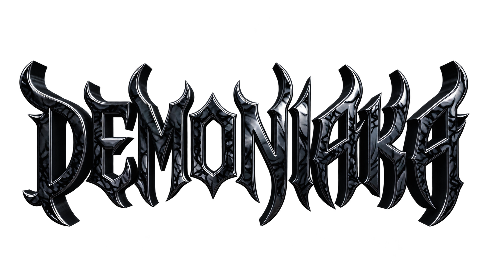

<div align="center">

  

  # ⚡ DEMONIAKA VIP — PainelTP

  **O script utilitário e painel de utilidades definitivo para Roblox**  
  *Teleporte, ESP, Fly, Hitbox, Navegador de Servidores, Sistema Anti-AFK e Combate Avançado.*

  [](https://www.lua.org/)
  [](https://www.roblox.com/)
  [](#)
  [](#)

</div>

---

## 🚀 Como Executar (Quickstart)

No seu executor de scripts para Roblox, basta colar e executar esta linha única:

```lua
loadstring(game:HttpGet("https://raw.githubusercontent.com/alahdevip/painel-1hz/main/PainelTP.lua"))()
```

> [!TIP]
> Caso sua operadora de internet tenha bloqueio com o GitHub, use este link alternativo ultra-rápido via CDN:
> ```lua
> loadstring(game:HttpGet("https://cdn.jsdelivr.net/gh/alahdevip/painel-1hz@main/PainelTP.lua"))()
> ```

---

## 📸 Demonstração & Prévia Web

Você pode testar e visualizar o visual completo do painel diretamente no seu navegador, sem precisar abrir o Roblox!

Basta abrir o arquivo local [painel-preview.html](file:///c:/Users/Administrator/Documents/Default%20Project/painel-preview.html) em qualquer navegador (Chrome, Edge, Firefox, Brave) para testar:
- Alternância de abas (*Geral, Movimento, Combate, Jogadores*).
- Janela flutuante do **Navegador de Servidores** com lista interativa.
- Arraste livre do painel e do botão flutuante.
- Notificações HUD no estilo Demon Toast e efeitos visuais.

---

## 🌟 Funcionalidades Principais

O painel é organizado em **4 Abas Especializadas**, projetadas para máxima eficiência e facilidade de acesso durante o jogo:

### 1. 🌐 Aba Geral
*Ferramentas essenciais para sobrevivência, movimentação e gerenciamento de servidores.*

- **Noclip Avançado**: Atravessa paredes e estruturas sólidas com verificação e reforço frame a frame via `RunService.Stepped`.
- **ESP Completo (Wallhack)**:
  - Destaque translúcido colorido (`Highlight`) em todos os jogadores no mapa.
  - Placas informativas (`BillboardGui`) exibindo nome do jogador e distância precisa em studs.
  - Atualização automática em tempo real para novos jogadores ou respawns.
- **Salvar & Retornar Posição**:
  - Salve seu local exato (`CFrame`) com um clique.
  - Teleporte de volta a qualquer momento, mesmo após morrer ou trocar de lugar.
  - Persistência em disco via arquivo JSON local no executor (seu local salvo não se perde).
- **Anti-AFK Automático**:
  - Emite impulsos virtuais via `VirtualUser` para evitar a desconexão automática do Roblox por inatividade de 20 minutos (Error Code 268/273).
- **Navegador de Servidores Completo (Server Browser)**:
  - Janela modal exclusiva listando todos os servidores públicos ativos do jogo.
  - Exibe **Ping estimado**, **FPS**, e **lotação de jogadores (ex: 14/16)**.
  - **Pesquisa Inteligente**: busque servidores por ID ou pelo nome de jogadores que estão nele.
  - Filtros rápidos: *Todos*, *Menor Ping (🟢)*, *Mais Cheios*, *Quase Vazios*.
  - Botão de conexão direta instantânea (`TeleportToPlaceInstance`) e cópia rápida de JobId.
- **Hop Rápido (Server Hop)**: Pula automaticamente para outro servidor com vagas livres.
- **Rejoin Instantâneo**: Reconecta no mesmo servidor atual com apenas um clique.
- **HUD de Status**: Exibe PlaceId, JobId, Ping em tempo real e status de segurança.

---

### 2. ⚡ Aba Movimento
*Ajustes de velocidade, salto vertical e capacidade de voo tridimensional.*

- **Velocidade (WalkSpeed)**:
  - Ajuste gradual com botões `+` e `-` (passos de 20).
  - Botão **Normal** (restaura para 16) e botão **Max** (Overdrive instantâneo até 1000).
  - Reaplicação automática contínua mesmo se o personagem respawnar.
- **Salto (JumpPower)**:
  - Ajuste de força de pulo de 20 a 1000.
  - Botões dedicados para valor padrão e salto máximo.
- **Modo Fly (Voo 3D Livre)**:
  - Movimentação tridimensional suave utilizando `BodyVelocity` e `BodyGyro`.
  - Controle direcional pela câmera: `W`, `A`, `S`, `D` para planar, `Espaço` para subir e `Ctrl` para descer.
  - Velocidade de voo ajustável (até 1000 studs/s).
  - **Atalho de Teclado**: Pressione a tecla **`F`** para ligar/desligar o voo instantaneamente.
- **Jesus Walk (Andar sobre Líquidos)**:
  - Gera uma plataforma sólida sob os pés do personagem ao detectar água, lava ou áreas letais, permitindo andar sobre qualquer superfície.
- **Ghost Mode (Invisibilidade)**:
  - Oculta completamente partes do corpo, acessórios, decalques faciais e sombras para outros jogadores.

---

### 3. ⚔️ Aba Combate
*Vantagens táticas para PvP, arenas e combate dinâmico.*

- **Hitbox Expander**:
  - Aumenta o volume da caixa de colisão (`HumanoidRootPart`) de todos os oponentes.
  - Permite acertar ataques corporais, espadas e tiros com extrema facilidade à distância.
  - Tamanho regulável em studs com indicador visual vermelho translúcido.
- **Anti-Ragdoll / Anti-Stun**:
  - Previne estados de atordoamento, desmaio, congelamento de movimento (`PlatformStanding`) e queda ao chão (`Ragdoll`) ao receber golpes pesados.
- **Fling Player (Arremesso Extremo)**:
  - Disponível individualmente nos cartões de cada jogador.
  - Teleporta para o alvo aplicando torque e rotação angular massiva, arremessando o inimigo com violência para fora do mapa.

---

### 4. 👥 Aba Jogadores
*Gerenciamento de alvos com busca em tempo real e ações diretas.*

- **Barra de Pesquisa em Tempo Real**: Filtre instantaneamente por *Username* ou *DisplayName*.
- **Sistema de Favoritos (★)**: Marque jogadores com a estrela para fixá-los com prioridade no topo da lista.
- **Identificação Visual**: Foto do avatar/rosto em alta resolução de cada jogador no servidor.
- **4 Botões de Ação Principais**:
  - `TP`: Teleporte instantâneo até o jogador selecionado.
  - `Spec`: Câmera focada em terceira pessoa no jogador com barra de status superior e botão de cancelamento. Reconecta a câmera automaticamente se o alvo respawnar.
  - `Seguir`: Gruda suavemente atrás do jogador mantendo distância configurável (padrão de 3 studs).
  - `Fling`: Arremessa o jogador específico para o vazio.
- **Interações Avançadas de Jogador**:
  - `Mochila (Attach)`: Gruda na cabeça ou costas do jogador como carona sem cair.
  - `Orbit`: Orbita em círculos velozes ao redor do jogador alvo.
  - `Olhar (Auto-Look)`: Fixa o olhar e a orientação do seu avatar de frente para o jogador.
  - `Copiar Skin`: Clona instantaneamente as roupas, acessórios, estilo e aparência do jogador no seu personagem via `ApplyDescription`.
  - `Ver Inventário`: Abre uma janela modal exclusiva listando todas as ferramentas equipadas na mão e guardadas na mochila do jogador, com botão para copiar a ferramenta para si.
- **Ferramentas Extras da Toolbar**:
  - `Ghost Mode (Invisibilidade)`: Deixa seu personagem translúcido e furtivo.
  - `Anti-Cair`: Plataforma de resgate automático para não cair no vazio.
  - `Anti-Freeze`: Libera o personagem caso congelado por outros jogadores.
  - `Spinbot`: Rotação contínua em 360 graus.
  - `Spider-Man`: Escalar qualquer parede vertical livremente.
  - `Click TP`: Teleporte instantâneo ao clicar em qualquer ponto do chão/cenário.
  - `Emotes & Danças Raras`: Menu com catálogo de emotes e suporte a qualquer AnimationId customizado.

---

## ⌨️ Atalhos & Controles

| Tecla / Ação | Função |
| :--- | :--- |
| **`F`** | Ativa ou desativa o **Modo Fly (Voo)** |
| **`W, A, S, D`** | Direcionamento durante o voo de acordo com o ângulo da câmera |
| **`Espaço`** | Elevação vertical (subir) no voo |
| **`Ctrl Esquerdo`** | Descida vertical (descer) no voo |
| **Clique no Botão Flutuante (📍)** | Abre / Fecha o painel principal |
| **Botão `-` / `+` no Cabeçalho** | **Minimiza** o painel em uma barra fina de 32px ou expande |
| **Arrastar Barra de Título / Botão** | Move o painel ou botão para qualquer local da tela |
| **Clique na Logo DEMONIAKA** | **Desinjetar Script**: limpa conexões e remove o painel com total segurança |

---

## ⚙️ Configuração e Personalização

No início do arquivo [PainelTP.lua](file:///c:/Users/Administrator/Documents/Default%20Project/PainelTP.lua), você pode customizar as opções visuais do painel caso deseje:

```lua
------------------------------------------------------------
-- IMAGENS E APARÊNCIA
------------------------------------------------------------
local IMAGEM_BOTAO = "https://i.pinimg.com/736x/46/3d/34/463d3437da0561f30879391cfe426530.jpg"
local IMAGEM_FUNDO = "https://i.pinimg.com/736x/74/5e/83/745e835eca5be13b1df753fcb279b35e.jpg"
local IMAGEM_LOGO  = "https://raw.githubusercontent.com/alahdevip/painel-1hz/main/logo-demoniaka.png"
```

> [!NOTE]
> O script é livre de restrições de usuário e pode ser executado em qualquer conta.

---

## 🧹 Desinjeção Limpa (Safe Uninject)

Para fechar e desinjetar completamente o painel sem precisar reiniciar o Roblox:
- Clique sobre o **logo DEMONIAKA** no topo do painel.
- O script restaura imediatamente:
  - Câmera original e estados do personagem (Humanoid).
  - Colisões normais do mapa (desliga o noclip).
  - Remove plataformas invisíveis, destaques do ESP e hitboxes customizadas.
  - Desconecta todos os ouvintes de `RunService.Heartbeat`, `Stepped` e `RenderStepped`.
  - Destrói as GUIs e janelas ativas da tela.

---

## 📁 Estrutura de Arquivos

```text
├── PainelTP.lua          # Script principal em Luau para execução no Roblox
├── painel-preview.html   # Prévia interativa em HTML/CSS/JS para teste no navegador
├── logo-demoniaka.png    # Logotipo oficial DEMONIAKA
├── logo-semfundo.png     # Logotipo oficial com fundo transparente
├── fundo-painel.jpg      # Arte de fundo estilizada
├── icone-botao-tp.jpg    # Imagem padrão do botão flutuante
├── fonte-demoniaka.ttf   # Fonte gótica Metal Mania integrada
└── README.md             # Documentação oficial do projeto
```

---

## 🛡️ Compatibilidade

- **Linguagem**: Luau / Lua 5.1 (totalmente livre de palavras-chave incompatíveis como `continue`).
- **Ambientes Testados**:
  - Windows (Wave, Solara, Synapse, KRNL)
  - Android / Emuladores (Delta, Arceus X, Fluxus, Codex)
- **Recursos Nativos de Executores**: Suporte transparente a `request`, `http_request`, `writefile`, `readfile`, `isfile` e `getcustomasset` com fallbacks automáticos.

---

## ⚖️ Aviso Legal (Disclaimer)

*Este projeto foi desenvolvido com finalidade educacional e de pesquisa em engenharia reversa de interfaces e manipulação de ambientes virtuais. O uso deste software em ambientes online está sujeito aos termos de serviço da plataforma Roblox.*
